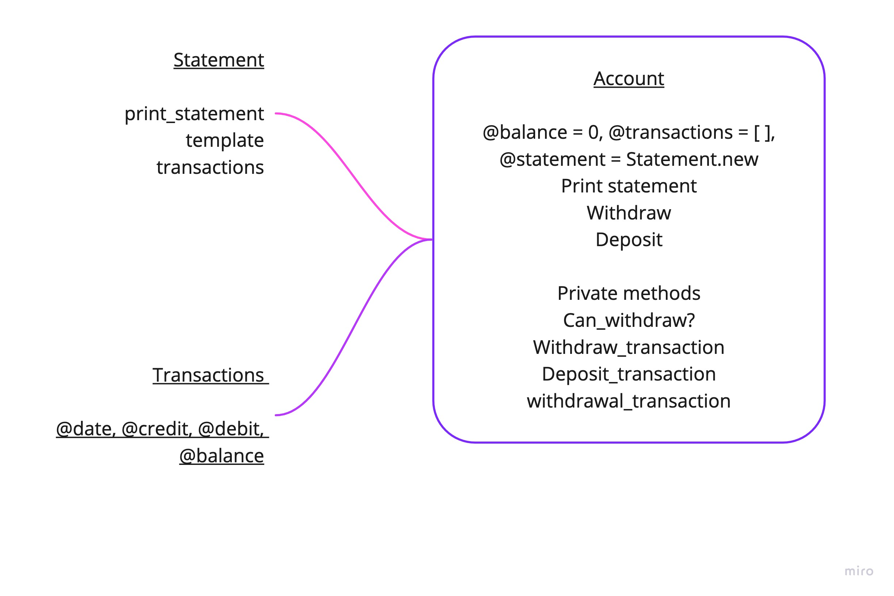

# Bank Tech Test

### Approach
I approached this tech test by first creating user stories, which were taken from a breakdown of the acceptance criteria.
I then started diagramming out how I expected the programme to work in a google document.
Lastly I visualised the methods that I felt I would require in order to meet the acceptance criteria of the program.

### User Stories
```
As a customer,
I want to be able to deposit money into my account,
So that I do not run out of money
```

```
As a customer,
I want to be able to withdraw money from my account,
So that I can spend the money I saved
```

```
As a customer,
I want to be able to print a full  statement of my account,
So that I can see what I've spent and deposited
```
### Planning

Here is my [class planning and breakdown](https://docs.google.com/document/d/1j1xMccRkOlpET7PLq8427yrgkl-zQ5Wsj4qcw52c7KU/edit). Visual from Miro:



## Specification

### Requirements

* You should be able to interact with your code via a REPL like IRB or the JavaScript console.  (You don't need to implement a command line interface that takes input from STDIN.)
* Deposits, withdrawal.
* Account statement (date, amount, balance) printing.
* Data can be kept in memory (it doesn't need to be stored to a database or anything).

### Acceptance criteria

**Given** a client makes a deposit of 1000 on 10-01-2012  
**And** a deposit of 2000 on 13-01-2012  
**And** a withdrawal of 500 on 14-01-2012  
**When** she prints her bank statement  
**Then** she would see

```
date || credit || debit || balance
14/01/2012 || || 500.00 || 2500.00
13/01/2012 || 2000.00 || || 3000.00
10/01/2012 || 1000.00 || || 1000.00
```
